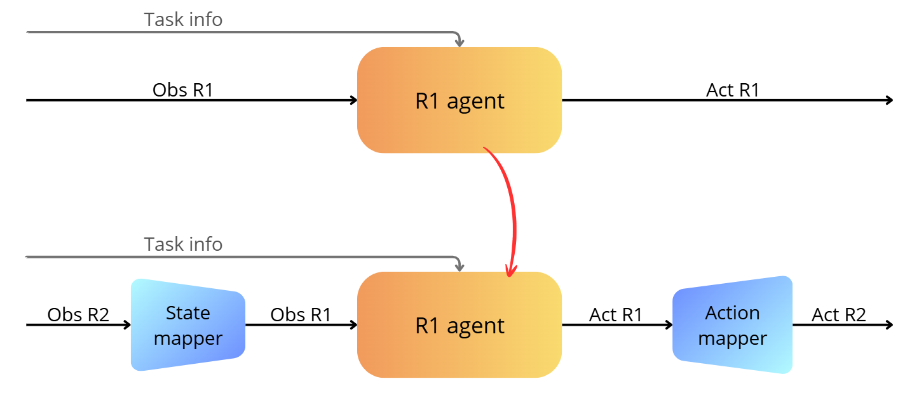
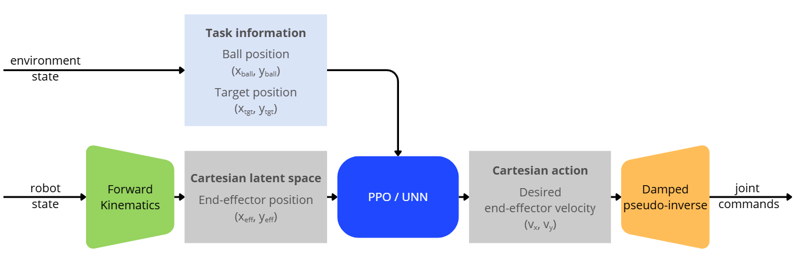
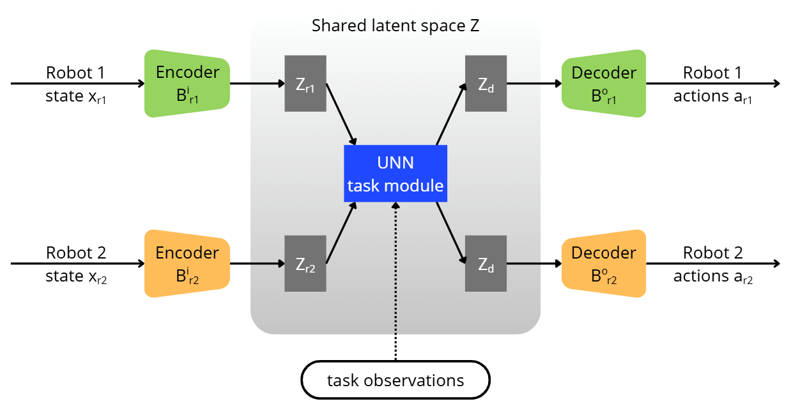

# Transfer Learning Between Robotic Arms

This project investigates the transfer of reinforcement learning policies
between robotic manipulators with different morphologies.

The objective is to evaluate whether a policy learned on a 2-DoF robot
can be transferred to a 3-DoF robot (and vice versa) without retraining.


## SETUP

In the *robot-robot* (or *database-robot*) folder:
```bash
# install python3
sudo apt update
sudo apt install python3-venv

# create venv
python -m venv .venv

# activate venv
source .venv/bin/activate 	    # linux
#.\.venv\Scripts\Activate.ps1 	# windows

# upgrade pip
python -m pip install --upgrade pip setuptools wheel

# install dependencies
python -m pip install -r requirements.txt
python -m pip install -r requirements-cuda.txt --index-url https://download.pytorch.org/whl/cu128 
```


### Requirements

python3

gymnasium
stable-baselines3>=2.0.0
numpy
matplotlib
PyQt5
tensorboard
tqdm
rich
opencv-python-headless
dtaidistance
scipy

torch
torchvision
torchaudio


## Repository Structure

### Robot-robot
```bash
project/
│
├── agents/                 # Expert agents scripts
│
├── direct_method/          # Transfer using the direct method
│
├── envs/                   # Robot simulation environments
│
├── lsunn/                  # Transfer using the LS-UNN method
│
├── unn/                    # Transfer using the UNN method
│
├── requirements.txt        # Python dependencies
├── requirements-cuda.txt   # Cuda dependencies
├── terminal.txt            # Commands to setup the .venv
└── README.md
```

When codes are executed, a data folder is created to contain files generated by the differents scripts (e.g. models, mappers, runs...)

#### Agents
```bash
agents/
│
├── train/                  # agents training codes
│
├── test/                   # agents test codes
│
├── record/                 # record successful and failed runs
│
├── visualize/              # runs visualization
│
└── terminal_agents.txt     # list of commands to execute 
```

Experts agents are trained on executing a *Ball Pushing* task using Reinforcement Learning and Proximal Policy Optimisation.


#### Direct method

```bash
direct_method/
│
├── Data_Robots/                # 
│
├── train/                      # Mappers training codes
│
├── test/                       # Transfer test codes
│
#├── record/                     # record successful and failed runs
│
├── visualize/                  # transfer visualization
│
└── terminal_direct_method.txt  # list of commands to execute 
```

Our approach directly transfers a fully PPO-trained agent from a source robot to a target robot with a different morphology. The main idea is to **adapt the source agent to the target robot** by mapping their states and actions into compatible representations.



To learn these mappings, both robots perform the same task, providing corresponding states and actions that form a supervised dataset. **Mapping networks (mappers)** are then trained to translate between the source and target spaces.

During transfer, these mappers adapt the target robot’s states and actions so that the **source PPO policy can be directly reused on the target robot**, without retraining the policy.


#### Universal Notice Network (UNN)

```bash
unn/
│
├── train/                  # agents training codes
│
├── test/                   # agents and transfers test codes
│
├── record/                 # record successful and failed runs
│
├── visualize/              # runs visualization
│
├── terminal_unn.txt        # list of commands to execute 
└── ...
```

The policy is split into robot-specific input/output modules and a task-specific module operating in effector space. The task module transfers across robots sharing this space.




**Source:** *Universal Notice Networks: Transferring Learned Skills Through a Broad Panel of Applications* - M. Mounsif, S. Lengagne, B. Thuilot, and L. Adouane

**Also see:** https://github.com/MoMe36/UNN_UnityEnvAndScripts 


#### Latent Space Universal Notice Network (LS-UNN)

```bash
lsunn/
│
├── train/                  # agents and VAE training codes
│
├── test/                   # agents test codes
│
├── terminal_lsunn.txt      # list of commands to execute
└── ... 
```

The hand-defined space is replaced with a *learned* agent-agnostic latent space (VAE-based), enabling zero-shot or fast fine-tuned transfer across robots with very different morphologies.




**Source:** *Towards Zero-Shot Cross-Agent Transfer Learning via Latent-Space Universal Notice Network* - S. Beaussant, S. Lengagne, B. Thuilot, and O. Stasse

**Also see:** https://github.com/sabeaussan/LS-UNN 


### Database-robot

[work in progress]


## Results

Success rate of different agents and transfers tests on the Ball Pushing task.

### Robot-robot

#### Expert PPO agents

| **Expert PPO agents** | **success rate** |
| :-------------------: | :--------------: |
|    **2-DoF Agent**    |      99.3 %      |
|    **3-DoF Agent**    |      99.5 %      |


#### Transfer with PPO aligned trajectories

| **Expert PPO agents** | **2-DoF Env** | **3-DoF Env** |
| :-------------------: | :-----------: | :-----------: |
|    **2-DoF Agent**    |     99.3 %    |     0.0 %     |
|    **3-DoF Agent**    |     1.8 %     |     99.5 %    |

#### Transfer with genetic algorithm aligned trajectories

| **Expert PPO agents** | **2-DoF Env** | **3-DoF Env** |
| :-------------------: | :-----------: | :-----------: |
|    **2-DoF Agent**    |     99.3 %    |     16.5 %    |
|    **3-DoF Agent**    |     55.0 %    |     99.5 %    |

#### Transfer using agents trained with Reconstruction

| **Reconstruction** | **2-DoF Env** | **3-DoF Env** |
| :----------------: | :-----------: | :-----------: |
|   **2-DoF Agent**  |     79.6 %    |     37.5 %    |
|   **3-DoF Agent**  |     30.0 %    |     62.4 %    |

#### UNN 

|  **UNN agents** | **2-DoF Env** | **3-DoF Env** |
| :-------------: | :-----------: | :-----------: |
| **2-DoF Agent** |     99.8 %    |     97.3 %    |
| **3-DoF Agent** |     99.6 %    |     97.0 %    |

#### LS-UNN

| **LS-UNN agents** | **2-DoF Env** | **3-DoF Env** |
| :---------------: | :-----------: | :-----------: |
|  **2-DoF Agent**  |     0.0 %     |      N/A      |
|  **3-DoF Agent**  |      N/A      |     0.0 %     |

[work in progress]


### Database-robot

[work in progress]
